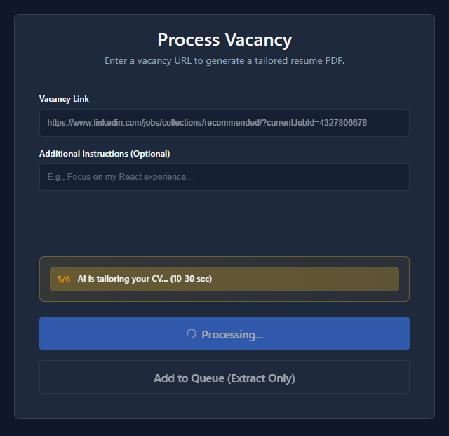
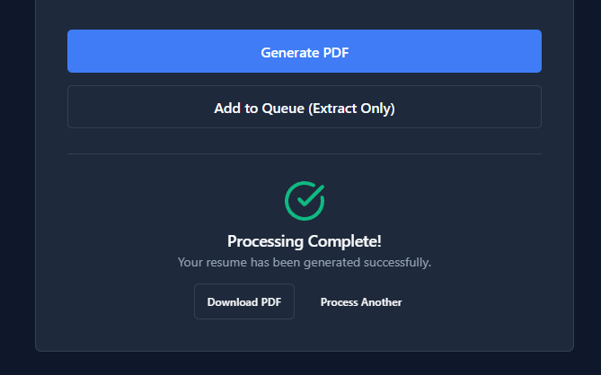
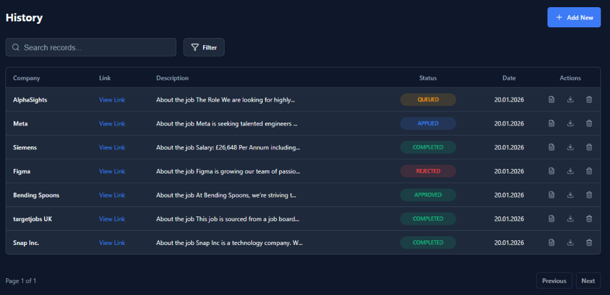
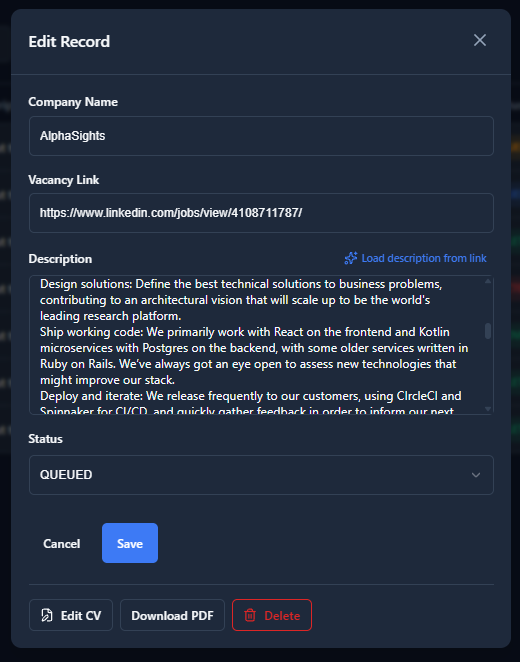
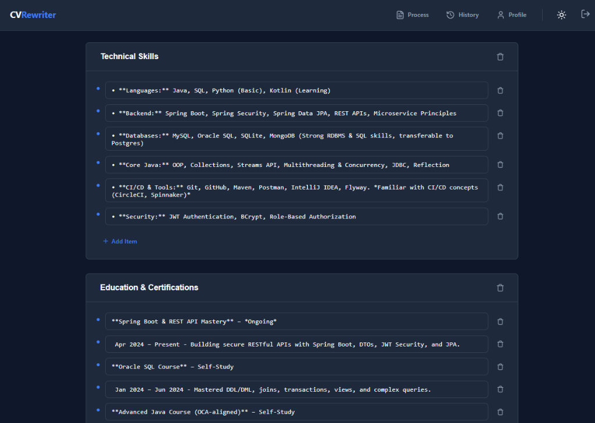
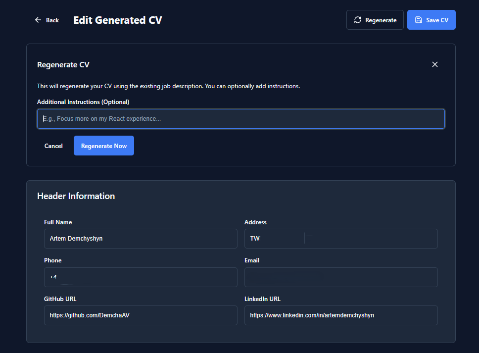
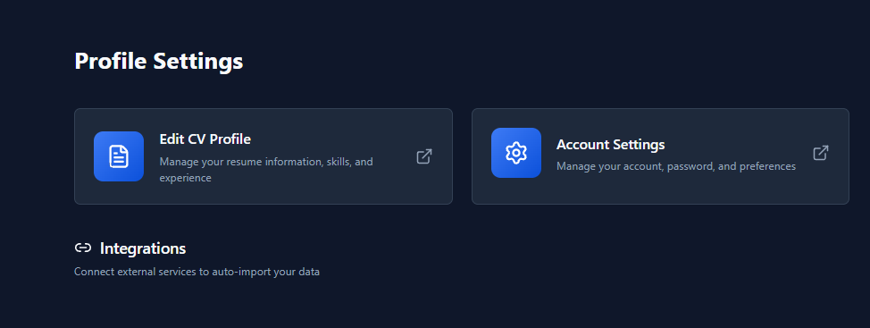

# CVRewriter

A full-stack platform that tailors a CV to a specific job vacancy. Paste a job URL, the backend scrapes the description, a multi-provider AI rewrite produces a structured CV, and the user gets a downloadable PDF — with full application tracking, history, and analytics around the workflow.

> This repository is a **public technical showcase** of the project. The production codebase is private. The goal here is to explain what was built, how it works, and the engineering decisions behind it — without exposing prompts, real credentials, or internal data.

## Why I built this

Job applications are repetitive. Most candidates either send the same CV to every opening (low signal, low response rate) or rewrite it by hand for every posting (high cost, doesn't scale). I wanted a tool that turns a job URL into a tailored CV in one pass — not a chat thread, not a blank template, but an end-to-end pipeline I'd actually use.

It also let me design something that touches a lot of interesting backend surfaces in one project: web scraping with anti-bot fallbacks, multi-provider AI with structured output, server-sent events with short-lived JWTs, Stripe webhooks, custom PDF rendering, three-environment Docker isolation, audit-grade history tables. Each layer had real constraints, not toy ones.

## What it does

1. User pastes a job vacancy URL (LinkedIn, Indeed, Glassdoor).
2. Backend scrapes the job description — HTTP-first, Playwright fallback on bot walls.
3. The selected AI provider (Gemini / GPT / DeepSeek) rewrites the user's CV against the JD, returning **structured JSON validated against a schema**.
4. Frontend streams progress via SSE — six stages, real percentages, not a fake spinner.
5. The result lands in a per-user record with status, rating, brief, full history.
6. The user reviews the generated CV in an editor, optionally regenerates with extra instructions, then downloads a PDF.
7. Premium subscribers (Stripe-backed) get access to additional templates.

Application records become a kanban-style tracker: status pipeline (Queued → Generated → Applied → Interview → Offer / Rejected), per-status time analytics, status-transition graph, rating, company, links.

## Screenshots

| | |
|---|---|
|  |  |
| Real-time progress via SSE | Generated CV ready to review |

| | |
|---|---|
|  |  |
| Application history with filters and statuses | Record edit modal |

| | |
|---|---|
|  |  |
| Section-by-section CV editor | Regenerate with additional instructions |



## Tech stack

| Layer | Technologies |
|---|---|
| **Backend** | Java 21, Spring Boot 4.0, Spring Security, Spring Data JPA |
| **Database** | MySQL 8 (H2 for tests), Flyway (28 migrations) |
| **AI** | Google Gemini, OpenAI GPT, DeepSeek — behind a shared `AiService<O>` interface |
| **PDF** | GraphCompose (my own canonical document engine, PDFBox-backed) |
| **Scraping** | Jsoup + JSON-LD parsing, Playwright fallback |
| **Real-time** | Server-Sent Events with short-lived SSE-scoped JWTs |
| **Billing** | Stripe (subscriptions, webhooks, customer portal) |
| **Frontend** | React 19, TypeScript 5, Vite 7, TanStack Query, React Hook Form + Zod |
| **Testing** | JUnit 5, Mockito, H2, Vitest, Playwright E2E |
| **DevOps** | Docker Compose, Nginx, per-environment isolation (prod / dev / test) |

## Architecture at a glance

```
              ┌──────────────────────────┐
              │  React 19 + Vite + TS    │
              │  TanStack Query + SSE    │
              └────────────┬─────────────┘
                           │ HTTPS / SSE
                           ▼
┌──────────────────────────────────────────────────────┐
│              Spring Boot 4 (Java 21)                 │
│                                                      │
│  ┌──────────┐   ┌──────────────────┐   ┌─────────┐   │
│  │  Auth    │   │  Vacancy         │   │ Billing │   │
│  │  (JWT)   │   │  Orchestrator    │   │ (Stripe)│   │
│  └──────────┘   └────────┬─────────┘   └─────────┘   │
│                          │                           │
│       ┌──────────────────┼──────────────────┐        │
│       ▼                  ▼                  ▼        │
│  ┌─────────┐       ┌──────────┐       ┌─────────┐    │
│  │Scraping │       │   AI     │       │   PDF   │    │
│  │Strategy │       │ Provider │       │ Render  │    │
│  │ Chain   │       │ (3 impls)│       │(GraphC.)│    │
│  └────┬────┘       └────┬─────┘       └─────────┘    │
│       │ Playwright      │ Token usage tracking       │
│       ▼                 ▼                            │
│  ┌─────────┐       ┌──────────┐                      │
│  │ Browser │       │  Prompt  │                      │
│  │  Pool   │       │  Hot-    │                      │
│  │ per usr │       │  Reload  │                      │
│  └─────────┘       └──────────┘                      │
│                                                      │
│       SSE Emitter Registry — 6 progress stages       │
└─────────────────────────────┬────────────────────────┘
                              │ JPA
                              ▼
                  ┌──────────────────────┐
                  │  MySQL 8 (Flyway)    │
                  │  Audit history tables│
                  └──────────────────────┘
```

See [docs/architecture.md](docs/architecture.md) for the full breakdown.

## Documentation

| Doc | What's inside |
|---|---|
| [docs/architecture.md](docs/architecture.md) | Modules, bounded contexts, package-by-feature layout, request lifecycle |
| [docs/data-flow.md](docs/data-flow.md) | End-to-end flow: URL paste → scrape → rewrite → persist → render PDF |
| [docs/technical-decisions.md](docs/technical-decisions.md) | Why the design looks the way it does, and what got rejected |
| [docs/security-and-privacy.md](docs/security-and-privacy.md) | Auth model, SSE token scoping, encryption at rest, what this repo intentionally omits |
| [docs/demo-workflow.md](docs/demo-workflow.md) | Walking through the product as a user |
| [docs/project-structure.md](docs/project-structure.md) | Folder map with one-line module purposes |
| [docs/future-improvements.md](docs/future-improvements.md) | Realistic next steps, not roadmap theatre |
| [.env.example](.env.example) | Sanitized environment-variable surface |

## Highlights worth calling out

- **Provider-agnostic AI** with structured JSON output. `AiService<O>` is a single interface; Gemini, GPT, and DeepSeek implementations enforce the same `AiCvCraftedDTO` schema via `victools/jsonschema-generator`. Provider can be switched at runtime through the admin API.
- **Two-tier scraping** with config-driven ordering. Cheap HTTP+JSON-LD first; Playwright + authenticated `BrowserContext` only when the HTTP path fails a usability check.
- **SSE scoped by a 120-second JWT**. The browser `EventSource` can't set `Authorization` headers, so the stream is `permitAll` at the security layer — but every request validates a separate `type=sse, jobId=...` token issued only after a JWT-authenticated ownership check.
- **AES-GCM encryption at rest** via a JPA `AttributeConverter`. Sensitive blobs are encrypted column-by-column with random IVs; the converter keeps a backward-compatible read path for the legacy AES-ECB format from earlier in the project.
- **Audit-grade history** on three orthogonal axes: pipeline status, application outcome, and template choice. Each gets its own append-only table with a `source` field (USER / SYSTEM / API).
- **Three Docker environments**, project-name-isolated (`cvrewriter-prod`, `-dev`, `-test`) on different ports and different MySQL volumes. Prod is treated as read-only-by-default; sync scripts move data prod → dev/test, never the other way.
- **Hot-reloadable prompts** via an external mount path, gated by an admin-only endpoint. Prompt iteration without a redeploy.

## Running it (high-level)

The real project runs end-to-end via:

```bash
# Pick one environment
./run.bat dev --build      # development
./run.bat test --build     # QA / integration
./run.bat prod --build     # production-like

./stop.bat dev --clean
```

This showcase does not ship the full Docker Compose files because they encode internal port mappings and volume layouts. The principles are documented in [docs/architecture.md](docs/architecture.md) and [.env.example](.env.example) gives the full sanitized variable surface.

## What this showcase intentionally omits

This repo deliberately does **not** contain:

- Real prompts (the prompt design is project IP)
- Real `.env.*` files or any secrets, API keys, or session data
- Production database dumps or third-party user records
- The full Spring Boot source tree or React frontend implementation
- Internal task boards, agent rules, or planning notes
- Docker Compose files with real port/volume mappings

The seven UI screenshots are real captures from the author's own account with email, full phone, and full address redacted at capture time. They are not synthetic — see [docs/security-and-privacy.md](docs/security-and-privacy.md#personally-identifying-data--whats-in-the-screenshots) for the exact disclosure.

## What this project demonstrates

- Designing a clean, package-by-feature backend that survives real growth — 16 features, 28 migrations, well-defined bounded contexts.
- Thinking about a workflow end-to-end: scraping resilience, AI provider abstraction, structured output, streaming UX, audit trails, billing, PDF rendering.
- Taking security and privacy seriously without over-engineering: stateless JWT, scoped SSE tokens, AES-GCM at rest, RFC 7807 problem details, prod data isolation.
- Treating production data as a real liability, not a convenience — explicit backup/sync scripts, environment isolation, prompt and config externalization.
- Documenting decisions, not just code. The `docs/` folder explains the *why* for every non-trivial choice.

## Author

**Artem Demchyshyn** — Java backend / full-stack engineer. Built CVRewriter to scratch a real itch and to have one project that exercises scraping, AI orchestration, real-time UX, payments, and document rendering end-to-end.

GitHub: [@DemchaAV](https://github.com/DemchaAV)

## License

This repository is licensed under the [Creative Commons Attribution-NonCommercial 4.0 International License](https://creativecommons.org/licenses/by-nc/4.0/) (CC BY-NC 4.0).

You may read, share, and reference this showcase with attribution, but commercial reuse is not permitted without permission.

Small code snippets, if present, are provided for educational and demonstration purposes only. This repository is a public technical showcase, not a reusable software package. The full license text is in [LICENSE](LICENSE).
